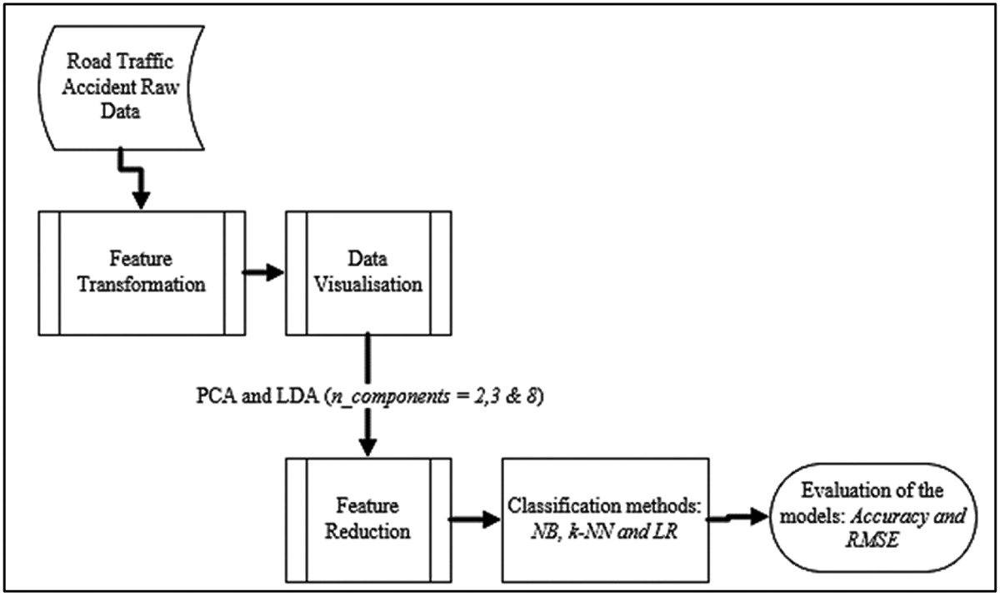
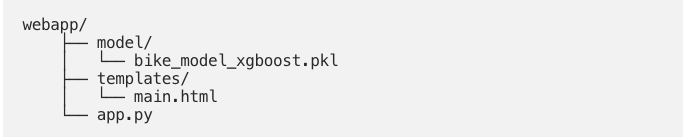

# 2R
2R (deux-roues) accidents analysis, prevention and prediction in Paris (75)

## About
This project is the final project of the Jedha Bootcamp training. It is led by three people.

## Content
`da` : data analysis \
`ds` : data science \
`doc` : articles & stackoverflow \
`prod` : ML production \
`.dvc & .dvcignore` : data version control \
`.gitignore` : version control \
`requirements.txt` : venv

## Workflow

* Data acquisition : source webpage, scrapping; 
* Data analysis : preprocessing & data visualization; 
* Data science : train, test and log models & metrics; 
* Production : model in production, API & website.

## Run project
### Github 
```git
git clone https://github.com/MKrouma/2R.git
cd 2R 
git checkout -b {YOUR_NAME}_dev
git add file.txt 
git commit -m "message blablabla"
git push origin {YOUR_NAME}_dev
```
make a pull request [PR link](https://github.com/MKrouma/2R/pulls)

### Virtual environment
```venv
python -V (python 3)
python -m venv env
source env/bin/activate (linux)
env\Scripts\activate (windows)
pip install -r requirements.txt
```

## Collaboration
We'll list some step and stuff to do as issues. 
You have to :
> choose an issue \
> assign yourself \
> create new branch as {YOUR_NAME}_{ISSUE_NUMBER}_others \
> develop \
> push on {YOUR_NAME}_{ISSUE_NUMBER}_others \
> make a PR \
> github actions will be checked code only for production.


## Production 
- App : prototype, design website(application, dashboard, story)
- Model : refactor, train, test, deploy, predict



 